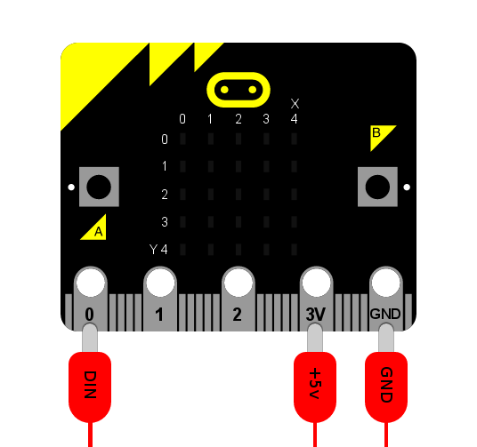

NeoPixel
********

.. py:module:: neopixel

NeoPixels are fun strips of multi-coloured programmable LEDs. This module
contains everything to plug them into a micro:bit and create funky displays,
art and games such as the demo shown below.

.. image:: neopixel.gif

To connect a strip of neopixels you'll need to attach the micro:bit as shown
below (assuming you want to drive the pixels from pin 0 - you can connect
neopixels to pins 1 and 2 too). The label on the crocodile clip tells you where
to attach the other end on the neopixel strip. Please note that the 3v output
from the micro:bit is often good enough to drive the neopixels.

Classes
=======

.. py:class::
    NeoPixel(pin, n)

    Initialise a new strip of ``n`` number of neopixel LEDs controlled via pin
    ``pin``. Each pixel is addressed by a position (starting from 0). Neopixels
    are given RGB (red, green, blue) values between 0-255 as a tuple. For
    example, ``(255,255,255)`` is white.

    .. py:method:: clear()

        Clear all the pixels.

    .. py:method:: show()

        Show the pixels.

Operations
==========

Writing the colour doesn't update the display (use ``show()`` for that).

.. code::

    np[0] = (255, 0, 128)  # first element
    np[-1] = (0, 255, 0)  # last element
    np.show()  # only now will the updated value be shown

To read the colour of a specific pixel just reference it.

.. code::

    print(np[0])
